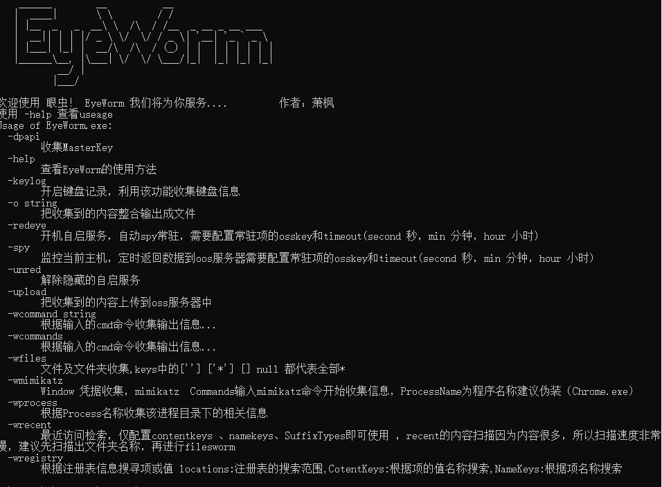
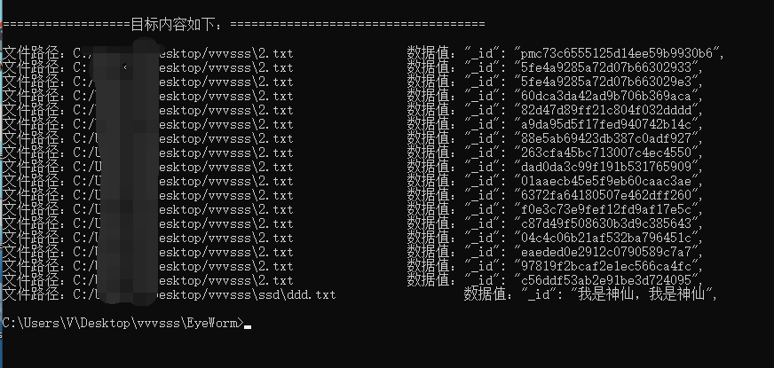
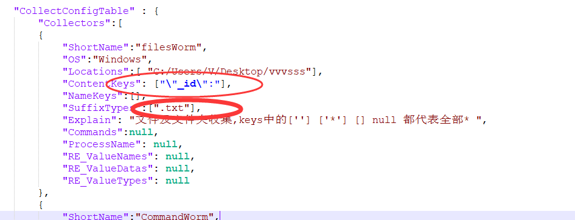

# EyeWorm
一款强大的内网收集信息工具，支持文件、进程、注册表、命令、DpApi凭据收集，支持键盘记录，常驻，oss服务器定时回传的功能（Windows）
 ## 功能 Func
 1.文件/文件夹/文件内容收集（自定义文件的：文件名、扩展名、内容 进行收集）
 
 2.命令行收集（自定义cmd 命令组 收集信息）
 
 3.注册表收集（可对注册表的项、值、值数据进行定制化收集）
 
 4.进程收集 （对目标正在运行的进程集逐一收集，定位运行路径，对内容、文件名、后缀进行收集）
 
 5.最近访问收集 （对最近访问文件的内容、文件名、扩展名进行定制化收集）
 
 6.Mimikatz （集成mimikatz，对多条命令同时收集）
 
 7.Masterkey （获取目标主机 masterkey）
 
 8.常驻模式---redEye (开机自启、伪装隐藏，定时上传)
 
 9.keylog （键盘监听）
 
 10.收集数据导出
 
 11.oss数据定时上传
 
 ## 使用 Useage
 
 1. 使用json配置文件，对目标主机收集任务进行配置 dist/EyeConfig.json
 
 2. go build  （编译后 配置数据嵌入exe中，如若更改 重新编译）
 
 3.  .exe -help 查看具体功能
## 注意 
若要开启常驻和mimikatz、MasterKey，需要system权限运行....

## 例子

## 联系我
欢迎热爱技术的兄弟一起交流！| QQ 1098516987 | [CSDN](https://blog.csdn.net/VB551)
